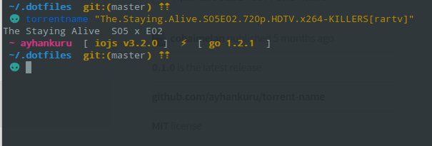

 ## Torrentname for [Fisherman](http://github.com/fisherman/fisherman).

## Install


```fish
$ fisher c0b41/torrentname
```


## Usage

```fish
$ torrentname "The.Staying.Alive.S05E02.720p.HDTV.x264-KILLERS[rartv]"
```

## Screenshot




# License

[MIT](http://opensource.org/licenses/MIT) © [c0b41]( http://github.com/c0b41) et [al](https://github.com/ayhankuru/gitremote/graphs/contributors) :heart:
